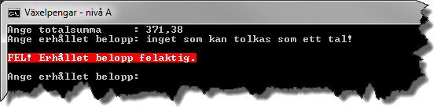
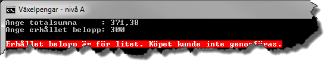

# Växelpengar - nivå B

## Problem

Då du handlar i en affär och betalar kontant får du kanske växel tillbaka. I regel får affärsbiträdet hjälp av kassaapparaten med att beräkna summan kunden ska få tillbaka. Vilka sedlar och mynt som ska lämnas tillbaka får affärsbiträdet själv räkna ut i huvudet. Kan ett program göra båda sakerna istället?

Skriv ett program som i samband med ett köp efterfrågar totalsumma och erhållet belopp, bestämmer öresavrundningen till närmsta hela krontal och beräknar den växel som ska lämnas tillbaka.

Eventuella fel i samband med inmatning av totalsumma och erhållet belopp ska hanteras. Det ska inte vara möjligt att ange en totalsumma mindre än en krona eller ett erhållet belopp mindre än totalsumman. Gör användaren en felaktig inmatning ska användaren erbjudas en ny möjlighet att mata in ett korrekt värde.


Figur B.1.

Programmet ska, förutom att presentera beloppet som kunden ska betala avrundat till närmsta hela krontal, även bestämma vilka, och antalet, sedlar och mynt som kunden ska få tillbaka så att så få sedlar och mynt används som möjligt.

Växel ska kunna ges tillbaka med sedlar av valörerna 500, 100, 50 och 20 samt mynten 10-, 5-, och 1-kronor. Du kan anta att det alltid finns tillräckligt antal av de sedlar och mynt som krävs. Skriv endast ut de sedlar och mynt som ska lämnas tillbaka!

Då en beräkning är gjord ska användaren kunna välja att avsluta programmet genom att trycka på _Escape_-tangenten. Trycks någon annan tangent ska användaren på nytt kunna mata in en ny totalsumma och nytt erhållet belopp.

## Öresavrundning

För att avrunda totalsumman till närmsta hela krontal kan du t.ex. använda den statiska metoden `Round` i klassen `Math`. Genom att bestämma differensen mellan den avrundade totalsumman och totalsumman erhålls öresavrundningen:

```c#
total = (uint)Math.Round(subtotal);
roundingOffAmount = total - subtotal;
```

Här är ```subtotal``` och ```roundingOffAmount``` variabler av typen ```double``` och ```total``` är en variabel av typen ```uint```.

## Krav

1. Indata till programmet ska vara totalsumma respektive erhållet belopp.
	1. Totalsumman ska kunna anges i kronor och ören.
	2. Erhållet belopp ska enbart kunna anges i hela kronor.
2. Inmatad totalsumma avrundas till närmsta hela krontal.
3. Utdata från programmet ska vara ett kvitto innehållande:
	1. Köpets totala summa.
	2. Öresavrundningen.
	3. Summa att betala efter öresavrundning.
	4. Erhållet belopp (kontant).
	5. Växel kunden ska ha tillbaka.
	6. Växeln kunden ska ha tillbaka ska även delas upp i lämpligt antal 500-, 200-, 100-, 50- och 20-lappar samt antal 10-, 5- och 1-kronor och bara presenteras om antalet sedlar och/eller mynt är större än 0.
4. Antalet sedlar och mynt ska bestämmas med hjälp av division- och modulusoperatorerna.
5. Samlingar som t.ex. arrayer får inte användas på något sätt.
6. Eventuella fel i samband med inmatningen ska tas om hand med hjälp av ”try-catch”-satser och användaren ska få en ny möjlighet att mata in.
	
	Figur A.2.
7. Om den inmatade totalsumman efter avrundning motsvarar ett belopp mindre än en krona är det att betrakta som ett fel varför programmet ska avslutas efter att ett felmeddelande presenterats.
 
	
	Figur A.3.

8. Om beloppet att betala efter öresavrundning är större än det erhållna beloppet är det att betrakta som ett fel varför programmet ska avslutas efter att ett felmeddelande presenterats.
 
	
	Figur A.4.


## Läsvärt

- variabler
	- Essential C# 6.0, 13-17.
	- http://msdn.microsoft.com/en-us/library/hh147285(VS.88).aspx#Variables
- %-operatorn
	- Essential C# 6.0, 91-92.
	- http://msdn.microsoft.com/en-us/library/0w4e0fzs.aspx
- ”if”-satsen
	- Essential C# 6.0, 111-118.
	- http://msdn.microsoft.com/en-us/library/5011f09h.aspx
- ”do-while”-satsen
	- Essential C# 6.0, 134-137.
	- http://msdn.microsoft.com/en-us/library/370s1zax.aspx
- “try-catch”-satsen
	- Essential C# 6.0, 202-209.
	- http://msdn.microsoft.com/en-us/library/0yd65esw.aspx
- Hantering av färger i ett konsolfönster
	- http://msdn.microsoft.com/en-us/library/yae1s0f9.aspx
	- http://msdn.microsoft.com/en-us/library/s66hf68a.aspx
	- http://msdn.microsoft.com/en-us/library/d3zkyxxe.aspx

[Lösning](losning/)
