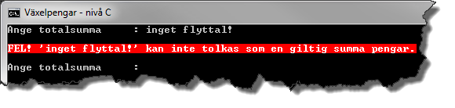

# Växelpengar - nivå C

## Problem

Då du handlar i en affär och betalar kontant får du kanske växel tillbaka. I regel får affärsbiträdet hjälp av kassaapparaten med att beräkna summan som kunden ska få tillbaka. Vilka sedlar och mynt som ska lämnas tillbaka får affärsbiträdet själv räkna ut i huvudet. Kan ett program göra båda sakerna istället?

Skriv ett program som i samband med ett köp efterfrågar totalsumma och erhållet belopp, bestämmer öresavrundningen till närmsta hela krontal och beräknar den växel som ska lämnas tillbaka.

Eventuella fel i samband med inmatning av totalsumma och erhållet belopp ska hanteras. Det ska inte vara möjligt att ange en totalsumma mindre än en krona eller ett erhållet belopp mindre än totalsumman. Gör användaren en felaktig inmatning ska denne erbjudas en ny möjlighet att mata in ett korrekt värde.


Figur C.1

Programmet ska, förutom att presentera beloppet som kunden ska betala avrundat till närmsta hela krontal, även bestämma vilka, och antalet, sedlar och mynt som kunden ska få tillbaka så att så få sedlar och mynt används som möjligt.

Växel ska kunna ges tillbaka med sedlar av valörerna 500, 200, 100, 50 och 20 samt mynten 10-, 5-, och 1-kronor. Du kan anta att det alltid finns tillräckligt antal av de sedlar och mynt som krävs. Skriv endast ut de sedlar och mynt som ska lämnas tillbaka!

Då en beräkning är gjord ska användaren kunna välja att avsluta programmet genom att trycka på _Escape_-tangenten. Trycks någon annan tangent ska användaren på nytt kunna mata in en ny totalsumma och nytt erhållet belopp.

Textmeddelanden till användaren ska hanteras med hjälp av en resursfil. Figur C.2 är ett exempel på en resursfil med strängar.


Figur C.2

## Öresavrundning

För att avrunda totalsumman till närmsta hela krontal kan du t.ex. använda den statiska metoden ```Round``` i klassen ```Math```. Genom att bestämma differensen mellan den avrundade totalsumman och totalsumman erhålls öresavrundningen:

```c#
total = (uint)Math.Round(subtotal);
roundingOffAmount = total - subtotal;
```

Här är ```subtotal``` och ```roundingOffAmount``` variabler av typen ```double``` och ```total``` är en variabel av typen ```uint```.

##Uppdelning av programmet

Programmet ska delas upp i de sex privata metoder som återfinns i klassdiagrammet i Figur C.3.


Figur C.3

_Main_

Denna metod ska anropa metoderna ```ReadPositiveDouble``` och ```ReadUint``` för att läsa in totalsumman respektive erhållet belopp. Efter att ha beräknat belopp att betala, öresavrundningen och växeln tillbaka ska metoden ```SplitIntoDenominations``` anropas, vilken returnerar en array med antalet av respektive valör som ska lämnas tillbaka. Satserna ska placeras i en ```do-while```-sats som avslutas då användaren trycker ner _Escape_-tangenten.

_ReadPositiveDouble_

Metoden ska returnera ett värde av typen ```double```. Innan värdet returneras ska metoden säkerställa att användaren matat in ett tal som, efter avrundning, är större eller lika med 1. Om det inmatade inte uppfyller detta villkor ska användaren få en chans att göra en ny inmatning.

Till metoden ska det vara möjligt att skicka en sträng med information som ska visas i samband med inmatningen. I Figur C.4 har argumentet ```"Ange totalsumma : "``` skickats med vid anropet av metoden.


Figur C.4

_ReadUint_

Metoden ska returnera ett värde av typen ```uint```. (Datatypen ```uint``` passar i detta fall då endast hela kronor motsvarande ett värde större än 0 ska hanteras.) Innan värdet returneras ska metoden säkerställa att användaren matat in ett tal som är större eller lika med angivet minsta värde (totalsumman). Om det inmatade inte uppfyller detta villkor ska användaren få en chans att göra en ny inmatning.

Till metoden ska det vara möjligt att skicka med två argument. Det första argumentet ska vara en sträng med information som ska visas i samband med inmatningen. Det andra argumentet är det minsta värdet som är giltigt. I Figur C.5 har argumenten "Ange erhållet belopp: " och 748 skickats med vid anropet av metoden.


Figur C.5

_SplitIntoDenominations_

Metoden ska dela upp växeln och returnera en array innehållande antalet av respektive valör som ska lämnas tillbaka. Till metoden ska det vara möjligt att skicka summan som ska delas upp och tillgängliga valörer i form av en array av typen ```uint```.

_ViewMessage_

Metoden anropas för att presentera meddelanden för användaren. Två typer av meddelanden ska kunna presenteras, vanliga meddelanden och felmeddelanden. Andra parameterns (```isError```) värde bestämmer typen av meddelande.


Figur C.6. Meddelande formaterat som ett vanligt meddelande då andra parameterns (isError) värde är false (dess standardvärde).


Figur C.7. Meddelande formaterat som felmeddelande då andra parameterns (isError) värde är true.

_ViewReceipt_

Metoden ansvarar för att ett kvitto enligt Figur C.8 presenteras. Inga beräkningar får ske i metoden utan allt data som ska presenteras skickas som argument till metoden. Enbart de valörer som ska lämnas tillbaka till kunden ska presenteras.


Figur C.8

## C-krav

1. Indata till programmet ska vara totalsumma respektive erhållet belopp.
	1. Totalsumman ska kunna anges i kronor och ören.
	2. Erhållet belopp ska enbart kunna anges i hela kronor.
2. Inläsning av totalsumma måste placeras i en separat statisk metod.
3. Inmatad totalsumma avrundas till närmsta hela krontal.
4. Inläsning av erhållet belopp måste placeras i en separat statisk metod.
5. Metoden ```SplitIntoDenominations``` ska dela upp växeln i lämpligt antal 500-, 200, 100, 50- och 20-lappar samt antal 10-, 5- och 1-kronor. Följande måste vara uppfyllt:
	1. En array innehållande giltiga valörer måste skickas som argument till metoden.
	2. Division- och modulusoperatorerna måste användas.
	3. Endast en ```if```-sats får användas.
	4. Antalet sedlar och mynt måste returneras i form av en array.
6. Metoden ```ViewReciept``` ska skriva ut ett kvitto innehållande:
	1. Köpets totala summa.
	2. Öresavrundningen.
	3. Summa att betala efter öresavrundning.
	4. Erhållet belopp (kontant).
	5. Växel som kunden ska ha tillbaka.
	6. Antal sedlar eller mynt ska bara presenteras om antalet är större än 0.
7. Vanliga meddelanden till användaren ska presenteras genom att anropa metoden ```ViewMessage```, som ska presentera ett formaterat meddelande.
	
	Metoden ```ViewMessage``` ska ha två parametrar. Första parametern ska vara av typen ```string``` och innehålla själva meddelandet. Andra parametern ska vara av typen ```bool``` och om dess värde är ```true``` ska meddelandet formateras som ett felmeddelande; är den ```false``` ska meddelandet formateras som ett vanligt meddelade. Andra parameterns värde ska ha värdet ```false``` som standardvärde.

8. Eventuella fel i samband med inmatning av totalsumma och erhållet belopp ska tas om hand med hjälp av ```try-catch```-satser och användaren ska få en möjlighet att mata in ett nytt värde. Användaren ska informeras om felet genom att metoden ```ViewMessage``` anropas som ska presentera ett formaterat felmeddelande.

	Figur C.9 till C.12 visar exempel på några felaktiga inmatningar som måste hanteras och ge användaren en ny möjlighet att mata in ett korrekt värde.

	

	Figur C.9. Resultat av en inmatning av totalsumma mindre än 1 kr.
	
	

	Figur C.10. Resultat av en inmatning som inte kan tolkas som en summa pengar.
	
	

	Figur C.11. Resultat av en inmatning där det erhållna beloppet är mindre beloppet att betala efter öresavrundning.
	
	

	Figur C.12. Resultat av en inmatning där det erhållna beloppet inte kan tolkas som en summa pengar.

## Läsvärt

- variabler
	- Essential C# 6.0, 13-17.
	- http://msdn.microsoft.com/en-us/library/hh147285(VS.88).aspx#Variables
- Arrayer
	- Essential C# 6.0, 71-87. (Inte flerdimensionella arrayer).
	- http://msdn.microsoft.com/en-us/library/system.array.aspx
	- http://msdn.microsoft.com/en-us/library/hh127989%28v=vs.88%29.aspx#Anchor_2 (under rubriken Arrays)
- %-operatorn
	- Essential C# 6.0, 91-92.
	- http://msdn.microsoft.com/en-us/library/0w4e0fzs.aspx
- ”if”-satsen
	- Essential C# 6.0, 111-118.
	- http://msdn.microsoft.com/en-us/library/5011f09h.aspx
- ”do-while”-satsen
	- Essential C# 6.0, 134-137.
	- http://msdn.microsoft.com/en-us/library/370s1zax.aspx
- "foreach"-satsen
	- Essential C# 6.0, 140-142.
	- http://msdn.microsoft.com/en-us/library/ttw7t8t6.aspx
- Metoder
	- Essential C# 6.0, 161-175.
	- http://msdn.microsoft.com/en-us/library/ms173114.aspx
- Metoder med frivilliga argument
	- Essential C# 6.0, 197-201.
	- http://msdn.microsoft.com/en-us/library/dd264739.aspx
- Undantag
	- Essential C# 6.0, 202-209.
	- Essential C# 6.0, 433-440.
	- http://msdn.microsoft.com/en-us/library/0yd65esw.aspx
	- http://msdn.microsoft.com/en-us/library/1ah5wsex.aspx
	- http://msdn.microsoft.com/en-us/library/ww58ded5.aspx
- Hantering av färger i ett konsolfönster
	- http://msdn.microsoft.com/en-us/library/yae1s0f9.aspx
	- http://msdn.microsoft.com/en-us/library/s66hf68a.aspx
	- http://msdn.microsoft.com/en-us/library/d3zkyxxe.aspx

[Lösning](losning/)
